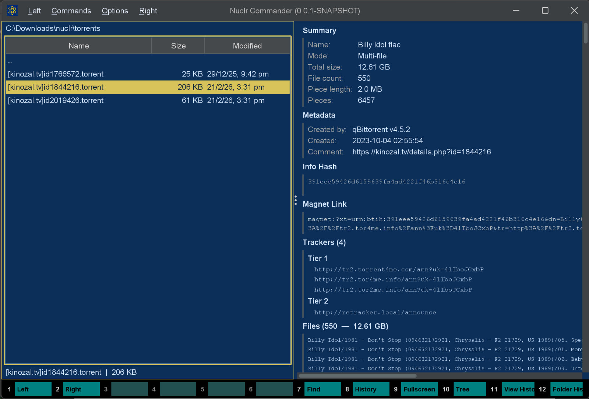

# 🧲 Torrent Quick Viewer

> Preview `.torrent` files inside **Nuclr Commander** with zero guesswork, zero network calls, and zero external tools.



## ✨ What This Plugin Does

**Torrent Quick Viewer** is an official [Nuclr Commander](https://nuclr.dev) plugin that turns raw `.torrent` files into a clean, rich, read-only preview panel.

Instead of staring at bencoded data, you get the important details instantly:

- 📦 Torrent name, mode, total size, piece size, and piece count
- 🗂️ Full file listing for multi-file torrents
- 🌐 Trackers grouped by announce tier
- 🔐 SHA-1 info hash with copy action
- 🧲 Full magnet link with copy action
- 📝 Comment, creation date, and created-by metadata
- 🚫 No tracker calls, no downloads, no peer traffic

## 🖼️ Preview

The quick view panel is designed to surface the details that actually matter when inspecting a torrent:

| Section | What you see |
|---|---|
| ⚡ Summary | Name, single vs multi-file mode, total size, file count, piece length, piece count, private flag |
| 📝 Metadata | Created-by string, creation date, comment |
| 🔐 Info Hash | 40-character lowercase SHA-1 hash with copy support |
| 🧲 Magnet Link | Full `magnet:?xt=urn:btih:...` URI including trackers |
| 🌐 Trackers | Unique trackers plus grouped announce-list tiers |
| 📂 Files | File path and size for every entry, capped at 500 rows |

## 🚀 Installation

Copy the signed plugin archive and detached signature into the Nuclr Commander `plugins/` directory:

```text
quick-view-torrent-1.0.0.zip
quick-view-torrent-1.0.0.zip.sig
```

Nuclr Commander verifies the `RSA-SHA256` signature against `nuclr-cert.pem` on load.

No restart. No manual activation. Drop it in and it is live. ⚙️

## 🛠️ Build

Prerequisites:

- ☕ Java 21+
- 🔨 Maven 3.9+
- 📚 Local `plugins-sdk` install (`mvn install` inside `plugins-sdk/`)

Build, test, package, and sign:

```bash
mvn clean verify -Djarsigner.storepass=<keystore-password>
```

Artifacts are written to `target/`:

- `quick-view-torrent-1.0.0.zip`
- `quick-view-torrent-1.0.0.zip.sig`

Signing expects this keystore configuration:

- Path: `C:/nuclr/key/nuclr-signing.p12`
- Alias: `nuclr`

### ⚡ Local Deploy

```bat
deploy.bat
```

This runs `mvn clean verify` and copies the built artifacts into:

```text
C:\nuclr\sources\commander\plugins\
```

## 🧠 How It Works

### 📚 Bencode parser

The plugin includes a zero-dependency parser that reads the raw `byte[]` content of the torrent file directly. It supports all four bencode types:

- integer
- byte string
- list
- dictionary

It also tracks the exact byte range of the `info` dictionary so the computed SHA-1 info hash matches the value BitTorrent clients and trackers expect.

### 🛡️ Safety limits

Malformed or hostile files are constrained with hard parser guards:

| Guard | Limit |
|---|---|
| Max nesting depth | 64 |
| Max total list/dict entries | 100,000 |
| Max byte-string length | 50 MB |

### 🔤 String decoding

Byte strings are decoded as **UTF-8** when valid, with fallback to **ISO-8859-1** for broader compatibility with older torrents.

### 🧵 Async loading

Parsing runs on a virtual thread so the Swing EDT stays responsive. The panel shows a loading state first, then swaps to the rendered preview or an error view when parsing completes.

## 📦 Plugin Manifest

```json
{
  "id": "dev.nuclr.plugin.core.quickviewer.torrent",
  "name": "Torrent Quick Viewer",
  "version": "1.0.0",
  "type": "Official",
  "quickViewProviders": [
    "dev.nuclr.plugin.core.quick.viewer.TorrentQuickViewProvider"
  ]
}
```

## 🗃️ Source Layout

```text
src/
├── main/java/dev/nuclr/plugin/core/quick/viewer/
│   ├── TorrentQuickViewProvider.java
│   ├── TorrentViewPanel.java
│   └── torrent/
│       ├── BencodeParser.java
│       ├── BencodeException.java
│       ├── TorrentParser.java
│       ├── TorrentMeta.java
│       └── TorrentFileEntry.java
├── main/resources/
│   └── plugin.json
└── test/java/dev/nuclr/plugin/core/quick/viewer/torrent/
    ├── BencodeParserTest.java
    └── TorrentParserTest.java
```

## 📄 License

Apache License 2.0. See [LICENSE](LICENSE).
